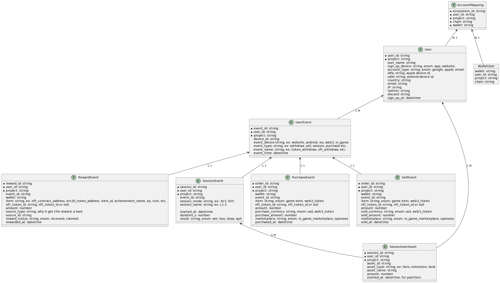

# Web 2 Data Catalog

One of the offerings of Telegraph Bay is the provision of accurate, standardized, and benchmarkable platform metrics. We achieve this by extracting, transforming, and loading all project data into our predefined tables. This ensures that the data you analyze is reliable and consistent, allowing for effective comparison and benchmarking of project performance.&#x20;

## Data Schema Design

<figure><figcaption>
Standardized Web 2 Platform Data Schema
</figcaption></figure>

## Standard Tables

#### account\_mapping

This table maps and associates user accounts across various platforms, enabling a unified view of user activity and interactions.

#### project\_mapping

The project\_mapping table establishes relationships between projects and their corresponding data, facilitating seamless navigation and analysis of project-specific information.

#### user

The user table stores essential user-related data, such as user IDs, usernames, and profile information, enabling comprehensive user analysis and segmentation.

#### user\_event

This table captures user-specific events, such as user registration, login, and activity tracking, providing valuable insights into user behavior and engagement.

#### session\_event

The session\_event table records session-level data, including session IDs, timestamps, and session durations. This information helps analyze user engagement patterns and session-based metrics.

#### asset\_flow

The asset\_flow table tracks the movement of assets within the platform, including spend, rewards, transfers, and other asset-related activities. This data enables analysis of purchase patterns and financial transactions.

