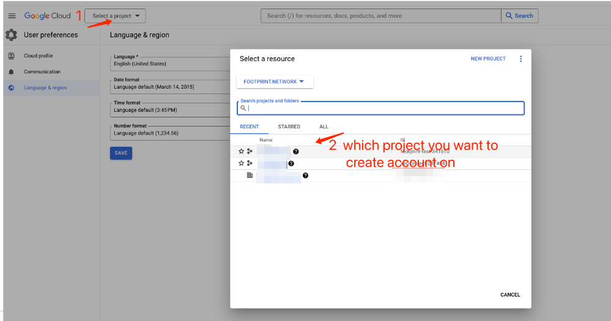

# Config Special View access in BigQuery

1. **4 Steps to Configure**
   1. Create a service account (for configuration purposes)
   2. Create three roles
      1. project\_access (for project-level permission control)
      2. dataset\_access (for dataset-level permission control)
      3. view\_access (for view view-level permission control)
   3. Configure permissions
   4. Testing&#x20;

<figure><figcaption></figcaption></figure>

2. **Create a service account**
   1.  Select the project in which you want to create the service account

       <figure><figcaption></figcaption></figure>

   2.  &#x20;Click on the left sidebar menu, select IAM & Admin -> Service Accounts.

       <figure><figcaption></figcaption></figure>
   3.  Click on CREATE SERVICE ACCOUNT.&#x20;

       * In the Service account details, input the account name,   then click DONE to finish creating the account.&#x20;
       * The account can be copied from the service account page.

       \

       <figure><figcaption></figcaption></figure>
3. **Create three roles**
   1. Click on the left sidebar menu, select IAM & Admin -> Roles.

<figure><figcaption></figcaption></figure>

b. Enter the Roles page, click on CREATE ROLE.

<figure><figcaption></figcaption></figure>

c. Create the **project\_access** role.&#x20;

<figure><figcaption></figcaption></figure>

<figure><figcaption></figcaption></figure>

* Enter the Create Role page, name the Title as project\_access, click on Add PERMISSIONS.&#x20;
* Enter the Add permissions page, in the Filter permissions by role, select BigQuery User, check the options bigquery.job.create and bigquery.job.list.&#x20;
* After clicking ADD to add them, finally click the CREATE button to complete the creation.

c. Create the **dataset\_access** role.&#x20;

* Follow the same process, but name the Title as dataset\_access.&#x20;
* In the Filter permissions by role, select BigQuery Data Viewer, and select the options bigquery.datasets.get, bigquery.tables.list, bigquery.tables.get.

<figure><figcaption></figcaption></figure>

d. Create the **view\_access** role.

* Follow the same process, but name the Title as view\_access.
* In the Filter permissions by role, select BigQuery Data Viewer, and select the option bigquery.tables.getData.&#x20;
*   Complete the creation.

    <figure><figcaption></figcaption></figure>

3. Configure permissions
   1. Assign the project\_access role to the service account.
      * Click on the left sidebar menu, select IAM & Admin -> Manage Resource..png>)
   2. Enter the Manage Resources page
      1. check the project need to configure
      2.  then click on ADD PRINCIPAL on the right side.

          <figure><figcaption></figcaption></figure>
   3.  Enter the Add Principals page

       * paste your service account into the New Principals field
       * select the project\_access role in the Role section (under the custom category)
       * then click SAVE to complete the project configuration.

       <figure><figcaption></figcaption></figure>
   4.  Configure permissions for the dataset and view:&#x20;

       1. &#x20;Click on the left sidebar menu
       2. then select BigQuery -> BigQuery Studio.

       <figure><figcaption></figcaption></figure>

e. On the left side, find the dataset for which you want to configure permissions.&#x20;

* Click on the selected data,
*   on the right side in the details page, click on SHARING -> Permissions.

    <figure><figcaption></figcaption></figure>

f. On the Permissions page, click on ADD PRINCIPAL.

* On the Add Principal page, paste your service account into the New Principals field, select the dataset\_access role in the Role dropdown (under the custom category)
* then click SAVE to complete the dataset configuration.
*

<figure><figcaption></figcaption></figure>

g. On the left side, select the table for which you want to configure permissions. On the right side in the  details page, click on the SHARE tab.

<figure><figcaption></figcaption></figure>

<figure><figcaption></figcaption></figure>

h. Similarly, on the Share page, click the ADD PRINCIPAL button.

* On the Add Principal page, select the view\_access role in the Role dropdown (under the custom category)
*   then click SAVE to complete the configuration.

    <figure><figcaption></figcaption></figure>

    <figure><figcaption></figcaption></figure>

    i. Grant the datasets that the view depends on the authorized view access

    * Enter the details page, click on DETAILS, scroll to the bottom, and you will find that the tested view depends on another datasets.

    <figure><figcaption></figcaption></figure>

    j. On the left, find the first dataset and click to enter its details page.&#x20;

    * Click on SHARING, then select Authorize Views.&#x20;
    *   On the configuration page, under Authorize View, select the view you want to configure, and click ADD AUTHORIZATION to complete the authorization configuration.

        <figure><figcaption></figcaption></figure>

<figure><figcaption></figcaption></figure>

Repeat the same steps for another table.

4. **Testing**
   1.  Download the service account key. Go to the Service Accounts page.

       <figure><figcaption></figcaption></figure>
   2.  Find the service account, click on the link to go to the service account's detail page.

       <figure><figcaption></figcaption></figure>
   3.  Click on KEYS -> ADD KEY -> Create new key, and obtain the JSON credential file.

       <figure><figcaption></figcaption></figure>

d. Then you can only query the table granted permission, but you cannot query other tables.\
