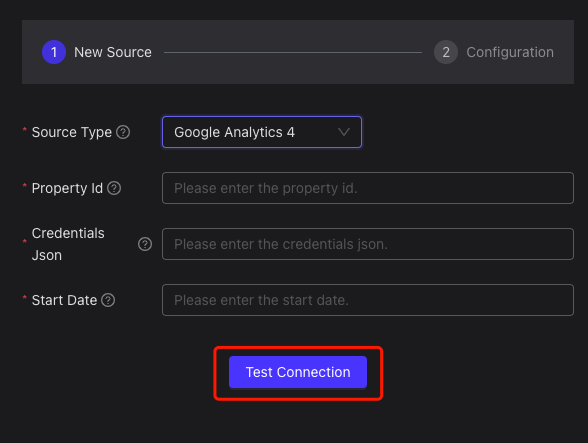

# Google Analytics 4 Setup Instructions

Google Analytics 4 Setup Instructions

***

### 1. Create Google Account

> **Before you begin**
>
> * If you don't have a Google account, [create one here](https://accounts.google.com/signup).
> * If you already have a Google account, proceed to the next steps.

***

### 2. Create Service Account

#### Steps:

a. **Sign in** to your Google Account (admin privileges required).\
b. Navigate to the [Service Accounts page](https://console.developers.google.com/iam-admin/serviceaccounts).\
c. Select or create a project, then click **Continue**.\
d. Click **+ Create Service Account**.

<figure><figcaption></figcaption></figure>

e. Enter a **Name** and optional description. Click **Create** > **Continue**.\
f. Assign the **Viewer role** (recommended). Click **Continue**.

<figure><figcaption></figcaption></figure>

g. Open your new service account, go to the **Keys** tab, and click **Add Key** > **Create New Key**.\

<figure><figcaption></figcaption></figure>

h. Select **JSON** as the key type. Download the JSON file for authentication.\

<figure><figcaption></figcaption></figure>

***

### 3. Create GA4 Properties & Apps

* Log in to [Google Analytics 4](https://analytics.google.com/).
* Follow the prompts to create a new property and app.

<figure><figcaption></figcaption></figure>

<figure><figcaption></figcaption></figure>

* Fill in details based on your requirements (e.g., website URL, events to track).

<figure><figcaption></figcaption></figure>

<figure><figcaption></figcaption></figure>

***

### 4. Initiate Data Collection (GA4)

1.  Select your data source (e.g., **Website**).

    <figure><figcaption></figcaption></figure>
2.  Enter website details and configure events. Click **Create and Continue**.\

    <figure><figcaption></figcaption></figure>
3. Follow the instructions to integrate tracking code for data collection.

***

### 5. Enable Google Analytics API

#### Steps:

a. Go to the [Google Analytics Reporting API Dashboard](https://console.developers.google.com/apis/api/analyticsreporting.googleapis.com/overview).

* Ensure the correct project is selected.
*   **Enable the API**.\

    <figure><figcaption></figcaption></figure>

b. For GA4, enable the [Google Analytics Data API](https://console.developers.google.com/apis/api/analyticsdata.googleapis.com/overview).

*   For Universal Analytics, use [Google Analytics API](https://console.developers.google.com/apis/api/analytics.googleapis.com/overview).\

    <figure><figcaption></figcaption></figure>

***

### 6. Add GA Roles

1. Navigate to [Property Access Management](https://analytics.google.com/analytics/web/#/a342689237p474644693/admin/suiteusermanagement/property).
2.  Add your service account with **Viewer** permissions.\

    <figure><figcaption></figcaption></figure>

***

### 7. Add Airbyte Connection Configuration

#### Steps:

a. In Airbyte, select **Google Analytics 4** as the source type.

<figure><figcaption></figcaption></figure>

b. Enter the **Property ID** (numeric value, e.g., `123456789`).

* [Find your Property ID](https://developers.google.com/analytics/devguides/reporting/data/v1/property-id).

c. Upload the **Service Account Key JSON** (downloaded in Step 2h).

d. Set the **Start Date** (format: `YYYY-MM-DD`).

e. Click **Test Connection**. Proceed if successful.

<figure><figcaption></figcaption></figure>

<figure><figcaption></figcaption></figure>

f. Configure **Sync Frequency** (e.g., hourly/daily).

<figure><figcaption></figcaption></figure>

g. Add tables and choose **Sync Mode**:

* **Incremental**: Sync new/modified data (requires cursor field and primary key).
*   **Full Refresh**: Sync all data.\

    <figure><figcaption></figcaption></figure>

    <figure><figcaption></figcaption></figure>

h. Click **Create Connection** to start syncing.

<figure><figcaption></figcaption></figure>
